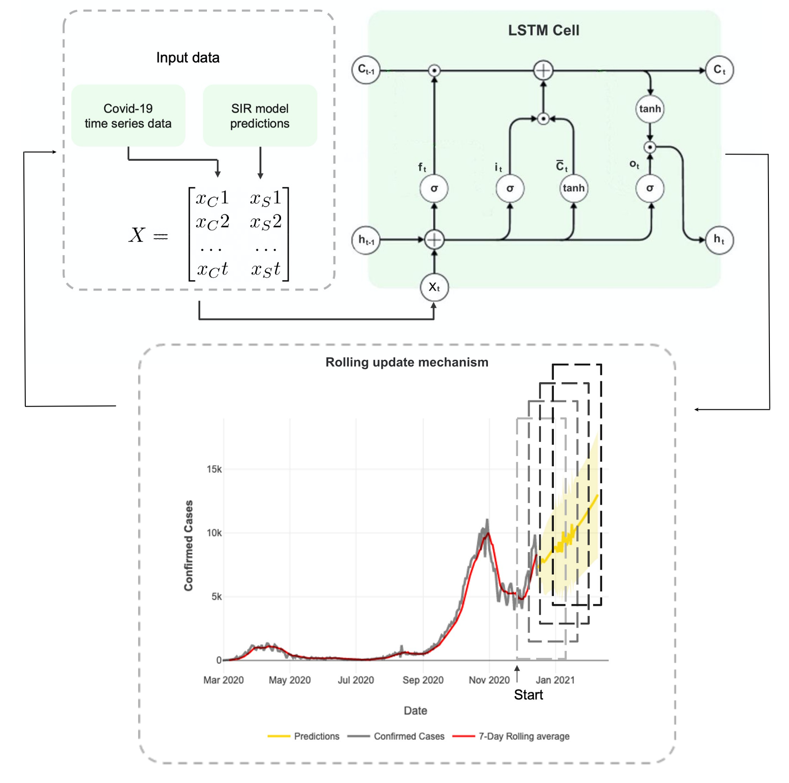
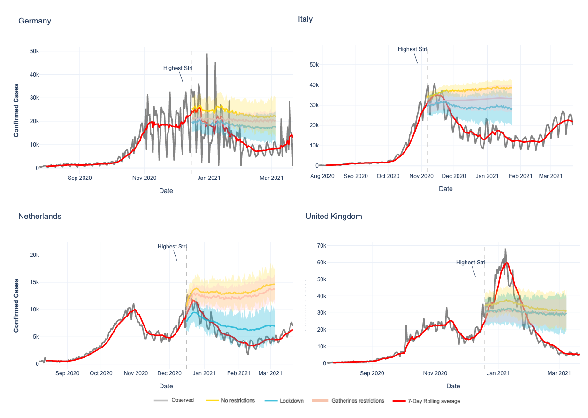

# SIR LSTM
### Hybrid model with both SIR variants and a LSTM model for Covid-19 predictions.

#### A comparison is made between SIR models and the ML model Long-Short-Term-Memory (LSTM) in predicting confirmed cases after an intervention. A hybrid model that combines SIR and LSTM is implemented in order to overcome model limitations. For predicting the trend of confirmed cases after an intervention, the hybrid model was able to outperform both SIR and LSTM. However, the most suitable model differs for every country and is based on the goal of the predictions. Model decision has to be based on whether the goal is to predict the confirmed cases on short- or long-term. For modelling interventions such as a lockdown, hybrid models can outperform SIR and LSTM models.

## Hybrid model architecture

## Hybrid model predictions of non-pharmaceutical interventions

Uncertainty Quantification Toolbox: Chung, Youngseog and Neiswanger, Willie and Char, Ian and Schneider, Jeff (2020), Beyond Pinball Loss: Quantile Methods for Calibrated Uncertainty Quantification

CovsirPhy Development Team (2020), CovsirPhy, Python package for COVID-19 analysis with SIR-derived ODE models, https://github.com/lisphilar/covid19-sir